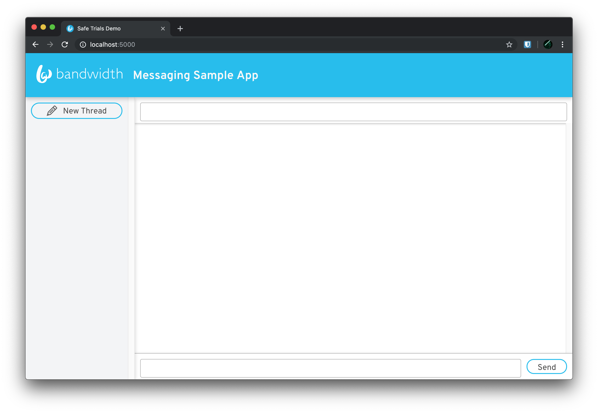

# Pushpay fork changes

1. The API url used by default is `https://api.catapult.inetwork.com/`. Change it to `https://messaging.bandwidth.com/api` instead.

# Bandwidth Messaging API Sample App

This app demonstrates how you can build a small server that works with Bandwidth's Messaging API. It will send and receive messages, store them and retrieve them, provide conversation threading, and provide a web interface that updates in realtime.


## Prerequisites

To use this sample, you will need a Messaging-enabled Bandwidth Account, and a MariaDB database to store your messages. This guide assumes that you already have MariaDB set up, and an empty schema called `messaging` created for use with this app. You will also need Node.js installed to run this sample.

## Setup

Download the source code:

    $ git clone https://github.com/BandwidthExamples/messaging-sample-app.git
    $ cd messaging-sample-app

### Set environment variables

You will need to fill in the appropriate values for your database connection, and API credentials in the `.env` file in the root of the project directory.

```
PORT=5000
USERNAME=messaging
DATABASE_HOST=127.0.0.1
DATABASE_PORT=3306
DATABASE_USERNAME=root
DATABASE_PASSWORD=
DATABASE_NAME=messaging

CATAPULT_USER_ID=
CATAPULT_API_TOKEN=
CATAPULT_API_SECRET=

APPLICATION_ID=
APPLICATION_NUMBER=
```

### Set the application number in the front end

You will also need to set your Application Number in the front end for the UI to display correctly. Edit `/client/.env` and set your number:

```
REACT_APP_APPLICATION_NUMBER=
```

### Create the database schema

You can use [Flyway](https://flywaydb.org/) to run the SQL migration script to create your schema. For example if you are running the DB on `localhost` you should be able to use the following command:
Flyway

    $ flyway -user=root -password="" -locations=filesystem:sql -url=jdbc:mariadb://localhost:3306/messaging migrate

Alternatively, you could just copy/paste the contents of the `sql/V1__create_schema.sql` file into your favorite SQL tool to create the schema.

## Install Node.js dependencies

    $ npm run install:all

## Build and run

    $ npm start
    Server listening on port 5000

## Start messaging!

Open a web browser and point it to `http://localhost:5000`
